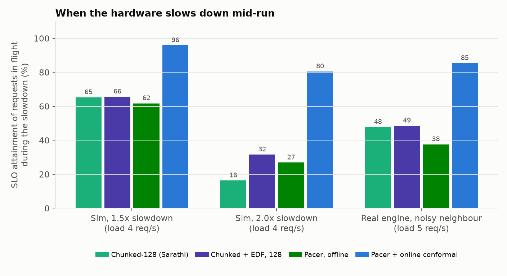
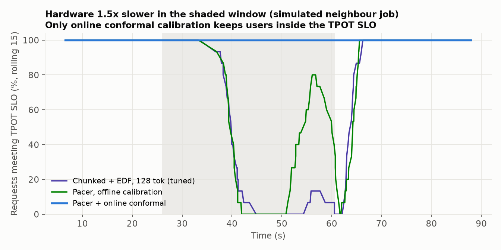
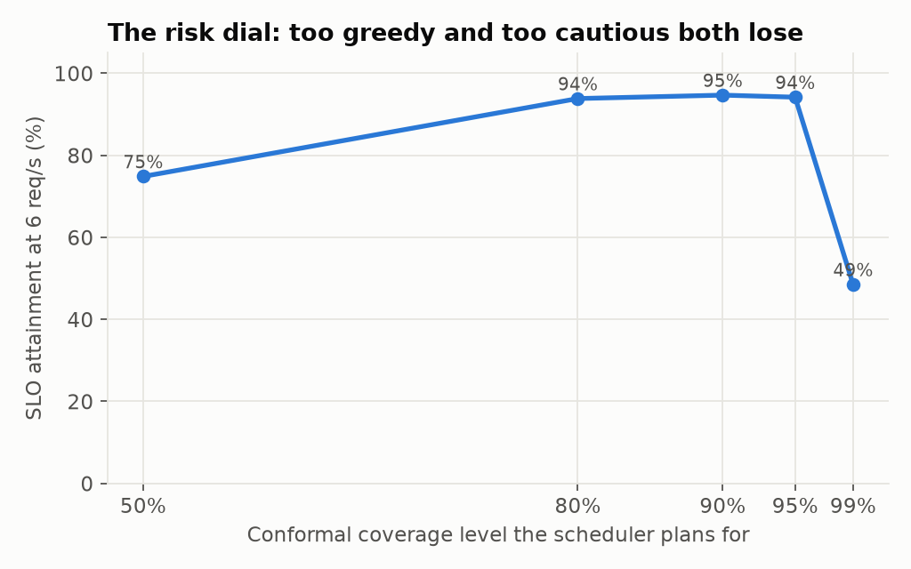

# Pacer: LLM serving that keeps its latency promises when the hardware doesn't

**An LLM inference server built from scratch (paged KV cache, continuous batching,
chunked prefill) whose scheduler predicts every step's latency, wraps that prediction in
a distribution-free risk bound that re-calibrates itself online, and orders prompts with
an exact algorithm for minimising missed deadlines.**

[](.github/workflows/ci.yml)
[Paper (PDF, 5 pages)](docs/paper/pacer.pdf) ·
[GPU notebook (Colab, free T4)](notebooks/gpu_benchmark.ipynb) ·
[Design notes](docs/DESIGN.md)

Headline results (all reproducible from this repo):

* **Under a real noisy neighbour** (a co-located process slowing the engine ~1.5x), Pacer
  kept **85%** of in-flight users within both latency SLOs. The best standard scheduler
  kept **49%**, and a smart scheduler that trusts its offline-calibrated model kept **38%**.
* **The risk guarantee holds on real hardware:** the scheduler targets 10% of steps
  exceeding their latency bound. Observed: **8.5-10.4%** across every real run, drift
  included.
* **Robust with zero tuning:** across six workloads, including two **real Azure
  production traces**, Pacer never drops below **94%** of the best policy's capacity.
  Every fixed-budget configuration falls to **70% or worse** somewhere.
* **More capacity than vLLM/Sarathi-style scheduling** on the real engine: 7.0 req/s at
  90% SLO attainment vs 4.71 for the best fixed chunk budget (+49%).



---

## The problem

Every LLM product serves two kinds of work on the same accelerator:

* **Prefill** (reading the prompt) is compute-bound and sets **TTFT**, time to first token.
* **Decode** (generating) is memory-bandwidth-bound and sets **TPOT**, time per output token.

Continuous batching mixes them in one step, so every step is a trade-off: each prompt
token you add slows every user who is mid-answer, and each one you hold back delays
someone's first token. Operators pay for **goodput**: requests per second that meet
*both* SLOs. Production schedulers use a static per-step token budget, tuned offline for
one model, one GPU, one SLO and one traffic pattern.

Two things break that in practice:
1. **Workloads move.** The best budget changes with the SLO, the traffic shape and the
   GPU (64 vs 128 vs 256 tokens in our sweeps; ~200 vs ~600 across NVIDIA GPUs).
2. **Hardware moves.** Co-located jobs, thermal throttling, noisy neighbours on shared
   GPUs, a driver update. A model calibrated on profiling day silently becomes wrong,
   and a scheduler that trusts it is *worse than a simple one* (38% vs 49% above).

## How Pacer works

```
every step:   maximise  prefill tokens c
              s.t.      q_t * predicted_latency(decodes + chunks(c)) <= SLO_tpot
              q_t       = online conformal bound on actual/predicted, updated after every step
              prompts   ordered by Moore-Hodgson: the provably minimal set of TTFT misses
```

| Piece | What it does | Evidence it matters |
|---|---|---|
| **Learned step-latency model** (`pacer/costmodel.py`) | Physics-shaped features (GEMM tokens, prefill attention FLOPs, decode KV bytes, padding, per-sequence overhead); non-negative coefficients with physical units | 7.3% error; 4.4% when extrapolating, where gradient-boosted trees collapse to 50.8% |
| **Online conformal risk control** (`OnlineConformal`) | Adaptive conformal inference (Gibbs & Candes, 2021) on the ratio actual/predicted. The long-run fraction of steps over the bound converges to alpha for *any* sequence, adversarial drift included | 85% vs 49% under a real noisy neighbour; miss rate 8.5-10.4% vs a 10% target |
| **Model-predictive token budget** | Binary search over the model (a dot product: microseconds) for the largest step that fits | +49% capacity over the best fixed budget on the real engine |
| **Moore-Hodgson prefill ordering** | Treats prefill as one machine and solves 1‖ΣU_j (maximise on-time jobs) exactly, in O(n log n) | +21% capacity over earliest-deadline-first on the bursty Azure code trace |

Full design and alternatives: [docs/DESIGN.md](docs/DESIGN.md).

## Results

Setup: 4-core cloud CPU (no GPU available), 63M-parameter Llama-architecture model, FP32.
SLOs: TTFT 2 s, TPOT 100 ms (other SLOs in section 3). 200 requests per run. "Capacity" is
the highest offered load at which at least 90% of requests meet both SLOs.

### 1. Hardware drift: the case static schedulers can't handle

**Real engine.** Midway through each run a neighbour process starts spinning 35% of one
core (`--hog 0.3 0.7 0.35`), slowing the engine ~1.5x, then stops.

| Real engine, noisy neighbour, 5 req/s | SLO attainment of requests in flight during the slowdown | Overall |
|---|---|---|
| Chunked prefill, 128 tok (Sarathi-style) | 47.7% | 71.5% |
| Chunked + deadline ordering, 128 tok | 48.6% | 72.0% |
| Pacer, offline calibration | 37.6% | 66.0% |
| **Pacer + online conformal** | **85.3%** | **92.0%** |

**Simulator** (3 seeds, slowdown during the middle 40% of the run, 4 req/s):

| In-drift SLO attainment | 1.5x slower | 2.0x slower |
|---|---|---|
| Chunked, 128 tok | 65.2% | 16.3% |
| Chunked + deadline ordering, 128 tok | 65.6% | 31.6% |
| Pacer, offline calibration | 61.7% | 26.9% |
| **Pacer + online conformal** | **95.8%** | **80.4%** |



**The guarantee, checked.** The scheduler plans for 10% of steps exceeding their bound:

| Runs | Observed fraction of steps over the online bound |
|---|---|
| Real engine, synthetic traffic (5 loads) | 9.9-10.2% |
| Real engine, Azure chat trace (3 loads) | 10.1-10.4% |
| Real engine, noisy neighbour (2 loads) | 8.5-9.6% |
| Simulator, 1.5x and 2.0x drift (24 runs) | 9.4-10.1% |

### 2. Steady state on the real engine

| Policy (real engine, measured) | @ 5 req/s | @ 6 req/s | @ 7 req/s | Capacity (req/s) |
|---|---|---|---|---|
| Prefill-first (vLLM v0 style) | 77.5% | 9.0% | 4.5% | 4.19 |
| Chunked prefill, best fixed budget (128 tok) | 86.0% | 51.0% | 21.0% | 4.71 |
| Chunked + Pacer's deadline ordering, 128 tok | 91.5% | 89.5% | 91.5% | 5.75 |
| **Pacer, offline calibration** | **96.5%** | **90.5%** | **90.0%** | **7.00** |
| **Pacer + online conformal** | **98.0%** | **90.0%** | 87.0% | 6.00 |


On the **real Azure production chat trace** (Splitwise, ISCA '24; arrival pattern and
lengths replayed, see `pacer/workload.py`), the real engine gives:

| Real engine, Azure chat trace | @ 5 req/s | @ 7 req/s | @ 9 req/s |
|---|---|---|---|
| Chunked, 128 tok | 79.5% | 64.0% | 61.0% |
| Chunked + deadline ordering, 128 tok | 98.0% | 89.0% | 82.0% |
| Pacer, offline | 100.0% | 88.5% | 83.0% |
| **Pacer + online conformal** | **100.0%** | **89.5%** | **84.5%** |

Run-to-run variance on a shared cloud VM is real: an earlier full run on the same machine
measured chunked-128 at 5.36 req/s capacity (vs 4.71 here). The multi-seed simulator
results below are the stable comparison.

### 3. Robustness: no knob to re-tune

Capacity as a fraction of the best policy in each scenario (simulator; 5 seeds for the
default and both Azure traces, 3 for the others):

| Policy | Poisson 100ms | Poisson 60ms | Poisson 150ms | Bursty CV=3 | Azure chat | Azure code | **Worst** |
|---|---|---|---|---|---|---|---|
| **Pacer, offline** | 1.00 | 0.99 | 1.00 | 0.98 | 0.97 | 1.00 | **0.97** |
| **Pacer + online** | 0.99 | 1.00 | 0.96 | 1.00 | 1.00 | 0.94 | **0.94** |
| Chunked + EDF, 128 tok | 0.99 | 0.70 | 0.94 | 0.88 | 0.95 | 0.99 | 0.70 |
| Chunked + EDF, 64 tok | 0.91 | 0.95 | 0.87 | 0.62 | 0.82 | 0.70 | 0.62 |
| Chunked (Sarathi), 256 tok | 0.77 | 0.69 | 0.80 | 0.67 | 0.72 | 0.54 | 0.54 |
| Chunked (Sarathi), 128 tok | 0.79 | 0.70 | 0.76 | 0.68 | 0.80 | 0.45 | 0.45 |
| Prefill-first | 0.66 | 0.65 | 0.74 | 0.61 | 0.63 | 0.00 | 0.00 |

A hand-tuned budget can tie Pacer on the scenario it was tuned for; none survives all six.


### 4. The latency model

Profiled on 600 randomly shaped steps of the real engine:

| Model | MAPE, random split | MAPE, extrapolation (train <=512 tok, test >512) |
|---|---|---|
| Roofline (measured peaks + 2 calibrated scalars) | 50.2% | 81.0% |
| Gradient-boosted trees | 17.9% | **50.8%** |
| Linear + GBDT residual (hybrid) | 9.9% | 5.0% |
| **Physics-informed linear (used by Pacer)** | **7.3%** | **4.4%** |

Offline split-conformal bounds also hold on held-out steps (90% bound: 93.3% coverage;
95%: 95.0%). The 99% bound is 13x the prediction: rare multi-x stalls of the shared VM
dominate the extreme tail.


### 5. Ablations (honest version)

Capacity in req/s (simulator, 5 seeds each):

| Variant | Poisson | Azure chat | Azure code |
|---|---|---|---|
| Pacer | 6.57 | 8.46 | 2.00 |
| ... with EDF instead of Moore-Hodgson | 6.54 | 8.60 | 1.65 |
| ... with FCFS ordering | 5.22 | 7.30 | 1.07 |
| ... with slack banking | 6.38 | 8.53 | 2.00 |
| Best fixed budget, FCFS | 5.19 | 7.01 | 1.08 |

* **Deadline-aware ordering is the biggest single win** in steady state (FCFS-Pacer
  barely beats a static budget).
* **Moore-Hodgson only matters under bursts.** It ties EDF on smooth traffic and wins by
  21% on the extremely bursty code trace, where choosing *which* requests to save matters.
* **Slack banking didn't help** (spending a request's banked TPOT slack on large
  prefills). It was in the first version of Pacer; the evidence removed it from the
  default, and it stays as a flag.
* **Online calibration costs 0-6% in steady state** (worst case 0.94 vs 0.97) and buys
  30-49 points of SLO attainment over the best baseline under drift. That is the
  insurance premium, measured.

**The risk dial.** Planning for 50% coverage (the plain point forecast) is too greedy
(75% attainment at 6 req/s), 99% is too cautious (49%), and 80-95% is a flat optimum
(94-95%). A calibrated bound turns a magic safety margin into one interpretable number.



### 6. The simulator is trustworthy

Same serving loop, schedulers and memory manager; the latency model replaces the
transformer. On identical traces it matches the real engine's SLO attainment to within
3.3 percentage points on average across 40 runs.


### 7. What this means on NVIDIA GPUs (analytic projection)

A decode step streams every weight from HBM, so extra tokens ride free until the step
reaches the GPU's roofline ridge point. For Llama-3-8B (BF16, 32 decodes at 2k context):

| GPU | Ridge (FLOP/byte) | Decode-only step | Prefill tokens that ride free |
|---|---|---|---|
| A100 80GB | 153 | 11.6 ms | ~200 |
| H100 SXM | 295 | 7.0 ms | ~424 |
| L40S | 419 | 27.3 ms | ~624 |
| L4 | 403 | 78.7 ms | ~592 |

These are first-principles projections from datasheet peaks, not GPU measurements. The
code runs unmodified with `--device cuda`.


## Engineering

* `pacer/model.py`: Llama-style decoder (RMSNorm, RoPE, GQA, SwiGLU) over a packed,
  variable-length batch; PagedAttention-style block gathers with a persistent workspace.
* `pacer/engine.py`: block manager; real executor; simulated executor with injectable drift.
* `pacer/scheduler.py`: prefill-first, chunked (Sarathi), chunked+EDF, and Pacer.
* `pacer/costmodel.py`: roofline, linear, GBDT, hybrid models; offline and online conformal.
* `pacer/workload.py`: synthetic Poisson/Gamma traffic and Azure production-trace replay.
* `pacer/cli.py`: `pacer demo | bench | profile | figures | test`.
* `docs/paper/`: a 5-page write-up with the step-level guarantee (Proposition 1) and its proof.
* `tests/`: the paged, chunked, mixed-batch engine reproduces a naive full-recompute
  forward pass token-for-token; scheduler invariants; online conformal coverage through a
  step change in hardware speed.

## Try it

```bash
pip install -e .[dev]
pacer test                    # 12 tests, including token-exact paged vs dense
pacer demo                    # serve 8 Shakespeare prompts with a trained model, Pacer scheduling
```

`pacer demo` uses a small character-level Llama-style model trained on TinyShakespeare
(`scripts/train_char.py`, saved to `results/shakespeare.pt`), so the engine produces real
text while you watch TTFT and TPOT per request.

**On a GPU:** open `notebooks/gpu_benchmark.ipynb` in Colab (Runtime > T4 GPU > Run all).
It profiles the engine on CUDA in FP16, finds the fixed-budget baseline's knee, and runs
the steady-state and noisy-neighbour benchmarks (`scripts/run_gpu.py`).

## Reproduce

```bash
pip install -e .[dev]
pytest -q
python scripts/profile_and_fit.py --shapes 600     # profile engine, fit + calibrate (~30 min CPU)
./scripts/run_real.sh                              # real engine: steady state, Azure, noisy neighbour (~50 min)
./scripts/run_sim.sh && python scripts/drift_timeline.py
python scripts/summarize.py && python scripts/roofline_projection.py && python scripts/make_figures.py
```

The Azure traces in `data/` are from [Azure/AzurePublicDataset](https://github.com/Azure/AzurePublicDataset)
(CC-BY 4.0).

## Limitations

* Measured on CPU with a small model; absolute latencies are CPU latencies and the GPU
  section is a projection. The prefill/decode structure, and the drift problem, are the
  same on GPUs.
* Azure traces are replayed with time compressed and lengths scaled by 0.2 to fit a CPU;
  the arrival pattern and the shape of the length distribution are preserved.
* Random weights (latency does not depend on weight values; correctness is tested).
* No preemption or swapping: requests reserve their full KV footprint at admission.
* Pacer raises goodput partly by letting already-hopeless requests wait, so their TTFT
  is worse than under FCFS. That is right for goodput, and wrong if every request must
  eventually be fast.
* ACI guarantees long-run step-level coverage, not per-request SLOs; the mapping from one
  to the other is measured (section 1), not proven.

## Related work

vLLM / PagedAttention (Kwon et al., SOSP '23); Orca (OSDI '22); Sarathi-Serve (OSDI '24);
DistServe (OSDI '24); Splitwise (ISCA '24); adaptive conformal inference (Gibbs & Candes,
NeurIPS '21); Moore-Hodgson (Management Science, 1968). I have not found published work
that combines online conformal risk control with model-predictive batch scheduling for
LLM serving and evaluates it under live hardware drift; if you know of some, please open
an issue so it can be credited.
