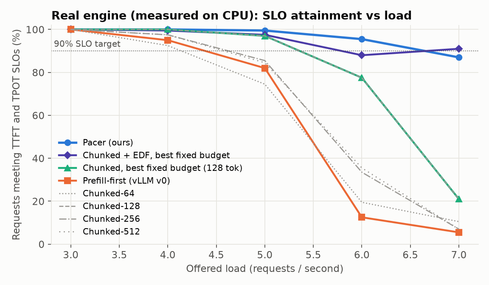
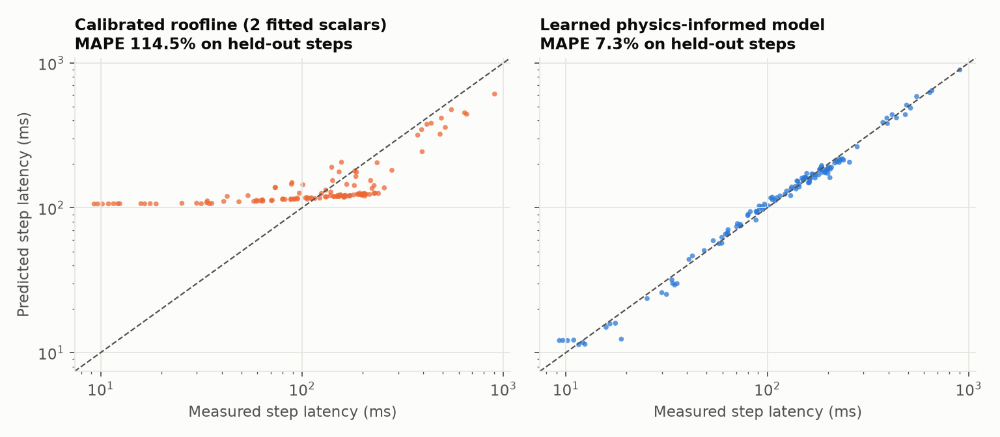
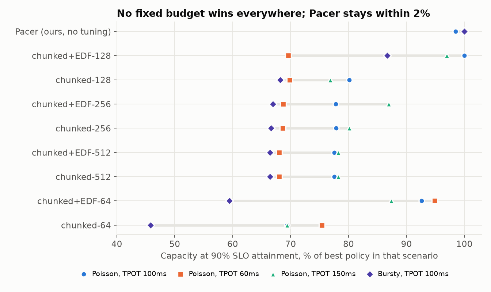
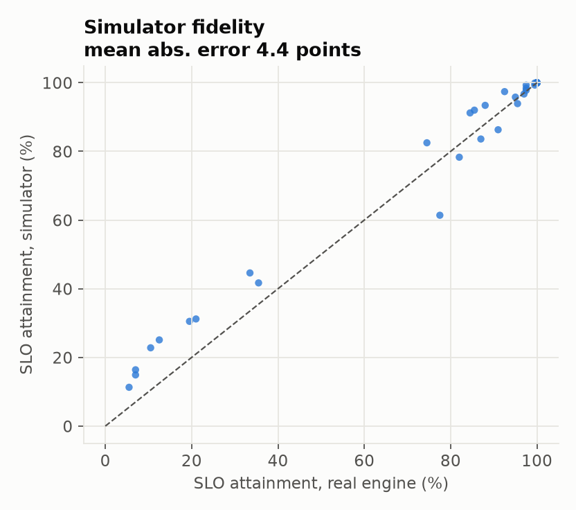
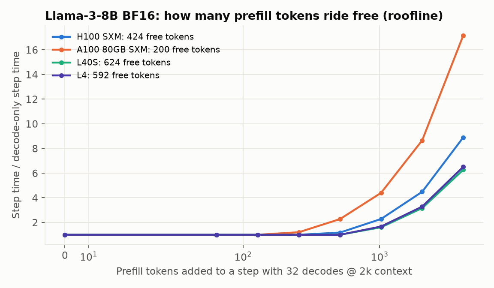

# Pacer: SLO-aware LLM serving with a learned, risk-calibrated latency model

**An LLM inference server built from scratch (paged KV cache, continuous batching,
chunked prefill) whose scheduler predicts the latency of every step before running it,
and packs each step with exactly as much work as the users' latency SLOs allow.**

On the same hardware and the same traffic, Pacer sustains **24% more load** than the
best-tuned standard chunked-prefill scheduler at 90% SLO attainment (measured on the
real engine), and **46% more under bursty traffic** (simulator, 3 seeds). Across four
traffic/SLO scenarios it stays within 2% of the best policy in every one with no tuning,
while every fixed-budget configuration, even with deadline ordering added, loses 30-54%
in at least one.



---

## Why this problem

Every LLM product serves two kinds of work on the same accelerator:

* **Prefill** (reading the prompt) is compute-bound and sets **TTFT**, time to first token.
* **Decode** (generating) is memory-bandwidth-bound and sets **TPOT**, time per output token.

Continuous batching mixes them in one step, so every step is a trade-off: each prompt
token you add slows every user who is mid-answer, and each one you hold back delays
someone's first token. What operators pay for is **goodput**, the requests per second
that meet *both* SLOs. Today's schedulers handle this with a static knob (a per-step
token budget) that has to be re-tuned for every model, GPU, SLO and traffic pattern.

## What Pacer does

```
every step:   maximise  prefill tokens c
              s.t.      q_cov * predicted_latency(decodes + chunks(c)) <= min TPOT deadline of running requests
              prompts   ordered earliest-TTFT-deadline-first; hopeless ones yield to savable ones
```

1. **Learned step-latency model** (`pacer/costmodel.py`). Physics-informed features
   (GEMM tokens, prefill attention FLOPs, decode KV bytes, padding, per-sequence
   overhead), non-negative coefficients fit to relative error. Every coefficient has a
   physical unit, so it extrapolates.
2. **Conformal risk calibration.** A split-conformal bound `q_cov` turns the point
   forecast into a guarantee: P(actual <= q * predicted) >= coverage, distribution-free.
   The scheduler's risk dial is a coverage level, not a magic margin.
3. **Model-predictive token budget.** Binary search over the model (a dot product, so
   microseconds) for the largest step that fits every running request's TPOT deadline.
4. **Deadline-aware prefill ordering.** Earliest-deadline-first, with requests that can
   no longer make their TTFT moved behind ones that can.

The full design, with the alternatives and their failure modes, is in
[docs/DESIGN.md](docs/DESIGN.md).

## Results

All numbers below come from scripts in this repo and are reproducible with the
commands at the end. Hardware: 4-core cloud CPU (no GPU available), 63M-parameter
Llama-architecture model, FP32. SLOs: TTFT 2 s, TPOT 100 ms. Traffic: lognormal prompt
and output lengths (median 192 / 48 tokens), Poisson arrivals unless noted, 200
requests per run.

### 1. The latency model is accurate and extrapolates

Profiled on 600 randomly shaped steps of the real engine:

| Model | MAPE, random split | MAPE, extrapolation (train <=512 tok, test >512) |
|---|---|---|
| Roofline (measured peaks + 2 calibrated scalars) | 50.2% | 81.0% |
| Gradient-boosted trees | 17.9% | **50.8%** (fails to extrapolate) |
| Linear + GBDT residual (hybrid) | 9.9% | 5.0% |
| **Physics-informed linear (used by Pacer)** | **7.3%** | **4.4%** |

The tree model memorises the training range and collapses outside it; the
physics-shaped model does not. That property is what makes it safe to put inside a
controller.

Conformal calibration holds on held-out steps: a 90% bound covered 93.3% of test steps,
a 95% bound covered 95.0%.



### 2. Real engine: more load at the same SLO

| Policy (real engine, measured) | SLO attainment @ 5 req/s | @ 6 req/s | @ 7 req/s | Max load at 90% SLO |
|---|---|---|---|---|
| Prefill-first (vLLM v0 style) | 82.0% | 12.5% | 5.5% | 4.38 req/s |
| Chunked prefill, best fixed budget (128 tok) | 97.0% | 77.5% | 21.0% | 5.36 req/s |
| Chunked + Pacer's EDF ordering, 128 tok (tuned, stronger baseline) | 97.5% | 88.0% | 91.0% | 5.79 req/s |
| **Pacer** | **99.5%** | **95.5%** | **87.0%** | **6.65 req/s (+24%)** |

At 7 req/s, Pacer's goodput is 4.34 SLO-meeting requests/s vs 1.06 for the best
fixed budget, a 4.1x difference. A second real trace (seed 1, lighter tail) at 5-7 req/s
gives Pacer 100% / 100% / 92.5% vs 100% / 98.5% / 52.0% for chunked-128, and 100% /
98.5% / 94.5% for the tuned chunked+EDF baseline: once a static budget is tuned *and*
given deadline ordering, it can match Pacer on the workload it was tuned for. Section 3
is about what happens off that workload.

### 3. Robustness: the real reason to learn the budget

The fair question is "what if I just tune the static budget?". So we also gave the
static baseline Pacer's deadline ordering (chunked + EDF) and swept every budget across
four scenarios in the simulator (5 seeds for the default, 3 for the others):

| Policy | TPOT 100 ms | TPOT 60 ms | TPOT 150 ms | Bursty (CV=3) | **Worst case** |
|---|---|---|---|---|---|
| **Pacer (no tuning)** | 0.98 | 1.00 | 1.00 | 1.00 | **0.98** |
| Chunked+EDF, 128 tok | 1.00 | 0.70 | 0.97 | 0.87 | 0.70 |
| Chunked+EDF, 64 tok | 0.93 | 0.95 | 0.87 | 0.59 | 0.59 |
| Chunked (Sarathi), 128 tok | 0.80 | 0.70 | 0.77 | 0.68 | 0.68 |
| Chunked (Sarathi), 64 tok | 0.69 | 0.75 | 0.69 | 0.46 | 0.46 |

*(Capacity at 90% SLO attainment as a fraction of the best policy in that scenario.)*

The best fixed budget moves from 64 tokens to 128 as the SLO changes, and the wrong
choice costs up to 30%. A hand-tuned static budget can tie Pacer in the scenario it
was tuned for; it cannot in the others.



### 4. Ablation: which idea buys what (honest version)

| Variant (sim, 5 seeds) | Max load at 90% SLO |
|---|---|
| Pacer | 6.38 |
| Pacer without slack banking | 6.54 |
| Pacer without deadline ordering | 5.24 |
| Best fixed budget (FCFS) | 5.19 |

* **Deadline-aware ordering is the largest single win.** Without it, the adaptive
  budget alone barely beats the best static budget.
* **Slack banking did not help** on this workload (it is within noise, slightly
  negative). Spending banked TPOT slack on big prefill chunks helps the request that
  arrived, but leaves no buffer for latency jitter later. It stays as a flag
  (`use_slack`) and the result is reported here rather than hidden.
* **Risk dial**: under injected 8% step jitter, coverage levels from 50% to 95% perform
  within noise of each other; 99% is far too conservative (-13% capacity) because the
  99% bound is dominated by rare multi-x stalls of the shared cloud VM. The calibrated
  bound makes that cost visible before deploying it.

### 5. The simulator is trustworthy

The same serving loop, schedulers and memory manager run against the latency model
instead of the transformer. Against the real engine at the same traces, the simulator's
SLO attainment is off by a mean of 4.4 percentage points across 30 runs (figure below), so its 5-seed sweeps
are a valid stand-in for hours of real serving.



### 6. What this means on NVIDIA GPUs (analytic projection)

A decode step streams every weight from HBM, so extra tokens ride free until the step
reaches the GPU's roofline ridge point. For Llama-3-8B (BF16, 32 decodes at 2k context):

| GPU | Ridge (FLOP/byte) | Decode-only step | Prefill tokens that ride free |
|---|---|---|---|
| A100 80GB | 153 | 11.6 ms | ~200 |
| H100 SXM | 295 | 7.0 ms | ~424 |
| L40S | 419 | 27.3 ms | ~624 |
| L4 | 403 | 78.7 ms | ~592 |

The right budget differs by 3x across NVIDIA's own lineup. This is a first-principles
projection from datasheet peaks, not a GPU measurement; the code runs unmodified with
`--device cuda`, and a GPU run is the obvious next step.



## Engineering details

* `pacer/model.py`: Llama-style decoder (RMSNorm, RoPE, GQA, SwiGLU) over a packed,
  variable-length batch; PagedAttention-style block gathers with a persistent workspace
  (2x faster decode than per-slot gathers on CPU).
* `pacer/engine.py`: block manager, real and simulated executors.
* `pacer/scheduler.py`: prefill-first, chunked (Sarathi), chunked+EDF, and Pacer.
* `pacer/costmodel.py`: roofline, linear, GBDT, hybrid models; split-conformal bounds.
* `tests/`: the paged, chunked, mixed-batch engine reproduces a naive full-recompute
  forward pass token-for-token; scheduler invariants (every request completes, every KV
  block is returned, Pacer's chosen step is the largest that fits its target).

## Reproduce

```bash
pip install torch numpy scipy scikit-learn matplotlib pytest
export PYTHONPATH=.
pytest -q                                              # correctness
python scripts/profile_and_fit.py --shapes 600         # profile engine, fit + calibrate models (~30 min CPU)
python scripts/bench.py --mode real --rates 3 4 5 6 7 \
    --policies prefill-first chunked-64 chunked-128 chunked-256 chunked-512 chunked-edf-128 pacer
python scripts/bench.py --mode sim --rates 1 2 3 4 5 6 7 8 9 --seeds 0 1 2 3 4
python scripts/summarize.py && python scripts/roofline_projection.py && python scripts/make_figures.py
```

## Limitations

* Measured on CPU with a small model; absolute latencies are CPU latencies. The
  compute-bound-prefill / bandwidth-bound-decode structure is the same on GPUs, but the
  GPU claims here are projections.
* Random weights (latency does not depend on weight values; correctness is tested).
* Requests reserve their full KV footprint at admission; no preemption or swapping.
* Pacer improves goodput partly by letting already-hopeless requests wait: their p99
  TTFT is worse than under FCFS. That is the right trade for goodput, and the wrong one
  if every request must eventually be fast.

## Related work

vLLM / PagedAttention (Kwon et al., SOSP '23); Orca continuous batching (OSDI '22);
Sarathi-Serve chunked prefill (OSDI '24); DistServe goodput and disaggregation
(OSDI '24); split conformal prediction (Vovk et al.; Angelopoulos & Bates). Pacer's
contribution is combining a calibrated, extrapolating latency model with per-step
model-predictive budgeting and deadline-aware ordering, and measuring when each piece
matters.
